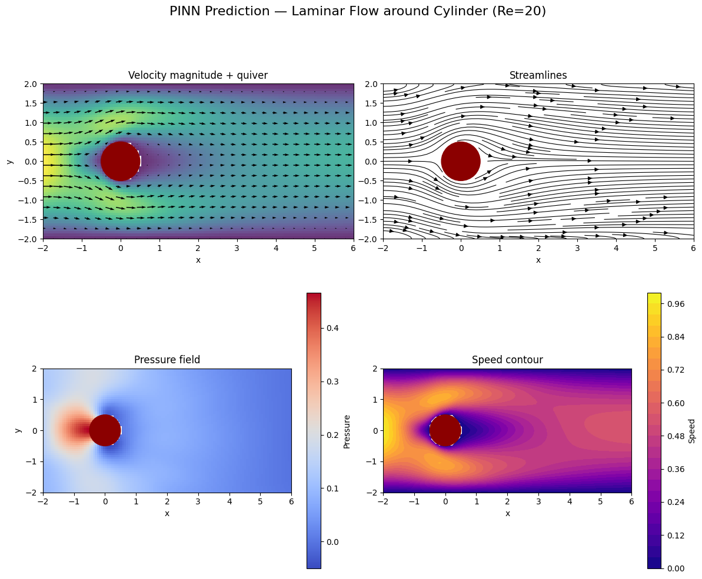

# Physics-Informed Neural Network (PINN) for Laminar Flow Around a Circular Particle

Implementation of a Physics-Informed Neural Network to solve the steady-state 2D incompressible **Navier–Stokes equations** for laminar flow around a circular particle at **Re = 20**.

Based on the paper:

> Applying Physics-Informed Neural Networks to Solve Navier–Stokes Equations for Laminar Flow around a Particle  
> MCA 2023, 28(5), 102  
> https://doi.org/10.3390/mca28050102

## Project Overview

This project demonstrates how to train a PINN to predict velocity components (u, v) and pressure (p) in a 2D channel with a circular obstacle, using only the governing equations and boundary conditions — **no labeled CFD data required**.

### Key features
- Steady incompressible Navier–Stokes equations
- Domain: rectangular channel [-2, 6] × [-2, 2] with circular particle (r = 0.5) at origin
- Parabolic inlet velocity profile
- No-slip condition on walls and cylinder surface
- Soft zero-pressure condition at outlet
- Purely physics-informed training (PDE residuals + boundary losses)
- Simple MLP architecture (tanh activation)
- Adam optimizer + optional L-BFGS fine-tuning

## Results

### Velocity and pressure fields (Re = 20)

